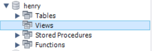

## Principales Objetivos de Aprendizaje para esta Clase

-Diferenciar el concepto de Subconsultas y Vistas
-Comprender en qué casos son útiles las Funciones Ventana

## Subconsultas

Una consulta secundaria es una consulta de selección que está contenida dentro de otra consulta. La consulta de selección interna generalmente se usa para determinar los resultados de la consulta de selección externa. Consiste en utilizar los resultados de una consulta dentro de otra, que se considera la principal.<br>
Es una sentencia SELECT anidada dentro de una instrucción SELECT, SELECT…INTO, INSERT…INTO, DELETE, o UPDATE o dentro de otra
subconsulta.<br>
Una subconsulta tiene la misma sintaxis que una sentencia SELECT exceptuando que aparece encerrada entre paréntesis, no puede contener la cláusula ORDER BY, ni puede ser la UNION de varias sentencias SELECT.<br>
Las consultas que utilizan subconsultas suelen ser más fáciles de interpretar por el usuario.<br>
Recordemos que dentrol SQL, los datos solo son accesibles a través de consultas. Es por ello que si queremos por ejemplo obtener la fecha donde ingreso el primer estudiantes dentrol del moodelo desarrollado en el modulo anterior, la instrucción sería la siguiente:

```SQL

SELECT MIN(fechaIngreso) AS fecha
FROM alumnos

```
Si tuvieramos la intención de utulizar este valor para obtener un listado de todos los estudiantes que ingresaron en esa fecha lo intuitivo sería lo siguiente:

```SQL

SELECT idAlumno, fechaIngreso
FROM alumnos
WHERE fechaIngreso = MIN(fechaIngreso)

```

Lo anterior no resulta posible, debido a que como mencionamos más arriba para poder acceder a ese valor MIN(fechaIngreso), se debe hacer una consulta. Es por ello que aquí radica la utilidad y el funamento en la utilización de subconsultas.

```SQL

SELECT idAlumno, fechaIngreso
FROM alumnos
WHERE fechaIngreso = (  SELECT MIN(fechaIngreso) AS fecha
                        FROM alumnos)
```

Resulta siempre muy importante entender que valor esta devolviendo una consulta específica, ya que de haber presentado esta última instrucción de forma inicial quizás la compresión hubiera sidi más difícil. Las subconsultas pueden devolver al igual que cualquier otra instrucción tablas o valores. Y estos resultados a su vez pueden utilizarse para otro tipo de operaciones.<br>

Las subconsultas son un proceso de selección interno, y se pueden utilizar en cualquier sentencia que permita una expresión.

SELECT: Para calcular y crear un nuevo campo virtual a la consulta principal.

FROM: Para devolver una tabla secundaria calculada o un campo calculado con un contexto diferente.

WHERE: Para definir filtros compuestos cálculados. Si se conociera el valor a calcular con la subconsulta, su utilizaría ese valor. Por ej:<br>
La fecha mas reciente "MAX(date)". El operador utilizado para comparar, depende del resultado de la subconsulta:<br>
Listas --> IN , NOT IN.<br>
Valor único --> = , >=, <=, etc.<br>

Las tablas de las subconsultas, solo "existen" en ellas. Es decir, por fuera del parentesis que abarca la subconsulta, no se pueden agregar campos que refieran a esa tabla. Salvo que se incluya en el FROM de la principal.

En resumen:<br>
- Cuando necesites agregar un filtro cálculado, agregarás una subconsulta en WHERE o HAVING.<br>
- Cuando necesites anexar un campo calculado de otra tabla y este NO requiera agregación, la utilizaras en SELECT.<br>
- Cuando necesites anexar un campo calculado de otra tabla y este SI requiera agregación, la utilizaras en FROM. Para romper el contexto de filas.<br>

EXISTEN MÁS CASOS Y POSIBILIDADES.

En cuestiones de rendimiento, no se puede asegurar al 100% que las subconsultas sean más efectivas que otros métodos como JOIN, UNION o variables, ya que en realidad esto depende de diversos factores como el manejo de los índices, el tamaño de las tablas, el motor de la base de datos, entre otros. No obstante, proveen una forma bastante interesante de extraer datos.

- [Subconsultas en MySQL](https://dev.mysql.com/doc/refman/8.0/en/subqueries.html)<br>
- [Subconsultas en SQL Server](https://docs.microsoft.com/es-es/sql/relational-databases/performance/subqueries?view=sql-server-ver15)<br>

## Vistas

Es un mecanismo que permite almacenar de forma permanete el resuLtado de una consulta en SQL. A su vez este resultado almacenado en la vista se puede acceder como si fuera una tabla, denominandose a la vista como una tabla virtual. <br>
Las vistas se componen de campos y filas provenientes del resultado de la consulta, las cuales pueden venir de varias tablas.<br>
Al igual que con los otros objetos que forman parte de la base de datos se crean mediante la sentencia CREATE y se eliminan mediante DROP.

```SQL
-- Crear una vista.
CREATE VIEW primerosAlumnos AS
SELECT idAlumno, fechaIngreso
FROM alumnos
WHERE fechaIngreso = (  SELECT MIN(fechaIngreso) AS fecha
                        FROM alumnos)

-- Obtener los resultados de una vista.
SELECT *
FROM primerosAlumnos

-- Modificar una vista.
ALTER VIEW primerosAlumnos AS
SELECT idAlumno, CONCAT(apellido," ",nombre), fechaIngreso
FROM alumnos
WHERE fechaIngreso = (  SELECT MIN(fechaIngreso) AS fecha
                        FROM alumnos)

-- Eliminar una vista
DROP VIEW primerosAlumnos

```
Al crear una vista, esta queda alojada en la base de datos correspondiente y se pueden ver en la iterfaz del gestor de base de datos.



Una vista actúa como filtro de las tablas subyacentes a las que se hace referencia en ella. La consulta que define la vista puede provenir de una o de varias tablas, o bien de otras vistas de la base de datos actual u otras bases de datos. Asimismo, es posible utilizar las consultas distribuidas para definir vistas que utilicen datos de orígenes heterogéneos. Esto puede resultar de utilidad, por ejemplo, si desea combinar datos de estructura similar que proceden de distintos servidores, cada uno de los cuales almacena los datos para una región distinta de la organización.

### Ventajas

- Permite centrar, simplificar y personalizar la forma de mostrar la información a cada usuario.<br>
- Se usa como mecanismo de seguridad, el cual permite a los usuarios obtener acceso a la información proveninete de la vista sin acceder a otras opciones.<br>
- Proporciona una sintaxis simple para acceder a los resultados de la vista.

- [Vistas en SQL Server](https://docs.microsoft.com/es-es/sql/relational-databases/views/views?view=sql-server-ver15#:~:text=Una%20vista%20es%20una%20tabla,en%20una%20base%20de%20datos.)<br>
- [Vistas en MySQL](https://dev.mysql.com/doc/refman/8.0/en/create-view.html)<br>

## Funciones Ventana

MySQL ha admitido funciones de ventana desde la versión 8.0. Esta función se admite desde hace mucho tiempo en la mayoría de las bases de datos comerciales y algunas bases de datos de código abierto, y algunas también se denominan funciones analíticas.

El concepto de ventana es muy importante, puede entenderse como un conjunto de registros y una función que se ejecuta sobre un conjunto de registros que cumple determinadas condiciones. Para cada registro se debe ejecutar una función en esta ventana.
Es decir que se trabaja en la relación de una fila con el resto, dentro de la ventana definida, o bien, selección de datos definida.
**Las funciones ventana evita los JOIN de una tabla consigo misma**, por ejemplo, si en una consulta de ventas por fecha, quisiéramos además tener el valor del promedio de venta, también por fecha, necesitaríamos por un lado, realizar una agregación de ventas por fecha, obteniendo el promedio y por el otro lado, realizar la consulta de todas las ventas para cada fecha, comparando así ambos valores:

```SQL
-- Promedio de ventas por Fecha:
SELECT 	Fecha, 
		AVG(Precio * Cantidad) AS Promedio_Ventas
FROM venta
GROUP BY Fecha;

-- Unimos el promedio de ventas por fecha con las ventas por fecha:
SELECT 	v.Fecha,
		v.Precio * v.Cantidad AS Venta,
        v2.Promedio_Ventas
FROM 	venta v JOIN (	SELECT 	Fecha, 
						AVG(Precio * Cantidad) AS Promedio_Ventas
						FROM venta 
                        GROUP BY Fecha) v2
ON (v.Fecha = v2.Fecha);
```

Ahora bien ¿cómo podría una función ventana ayudar en este caso?
En principio, vamos a concluir que nuestra "ventana" seran los registros pertenecientes a una misma fecha, sobre los cuales, vamos a aplicar una función de agregación para obtener el promedio. Notar la mejora en el tiempo de respuesta, **la función ventana viene con una mejora en la performance**.
La consulta final queda:

```SQL
SELECT 	v.Fecha,
		v.Precio * v.Cantidad AS Venta,
		AVG(v.Precio * v.Cantidad) OVER (PARTITION BY v.Fecha) AS Promedio_Ventas
FROM venta v;
```


La función ventana se puede descomponer en las siguientes partes:

* OVER: Define una ventana o conjunto de filas que debe utilizar una función ventana, incluyendo cualquier orden. No está restringido por sí mismo, e incluye todas las filas. Se pueden usar múltiples cláusulas OVER en una sola consulta, cada una con su propio particionamiento y ordenación si es necesario.

* Cláusula de partición (PARTITION BY): Las ventanas se agrupan según esos campos y las funciones de ventana se ejecutan en diferentes grupos.

* Orden por cláusula (ORDER BY): Según los campos a ordenar, la función de ventana numerará los registros según el orden de clasificación. Se puede utilizar junto con la cláusula de partición o solo.

* Cláusula de marco: El marco es un subconjunto de la partición actual. La cláusula se usa para definir las reglas del subconjunto y generalmente se usa como una ventana deslizante.
    * UNBOUNDED significa ir todo el camino al límite en la dirección especificada por PRECEDING o FOLLOWING (comienzo o final)
    * CURRENT ROW indica inicio o final en la fila actual en la partición
    * ROWS BETWEEN permite definir un rango de filas entre dos puntos

Repasemos algunos ejemplos de función ventana, tomando de base el modelo de datos con el que se viene trabajando hasta el momento.

Se requiere visualizar una tabla con el acumulado de la venta por fecha, en este caso, se hace uso del marco "ROWS BETWEEN UNBOUNDED PRECEDING AND CURRENT ROW" para tomar dentro de la partición, las filas desde el inicio de la misma hata la fila actual:

```SQL
SELECT 	v.Fecha,
		v.Precio * v.Cantidad AS Venta,
		SUM(v.Precio * v.Cantidad) OVER (PARTITION BY v.Fecha ROWS BETWEEN UNBOUNDED PRECEDING AND CURRENT ROW) AS Total_Ventas
FROM venta v;
```

Notar, que para este caso, se consigue un resultado similar con la cláusula "ORDER BY"

```SQL
SELECT 	v.Fecha,
		v.Precio * v.Cantidad AS Venta,
		SUM(v.Precio * v.Cantidad) OVER (PARTITION BY v.Fecha ORDER BY v.IdVenta) AS Total_Ventas
FROM venta v;
```


Se requiere visualizar por fechas, el ranking de las ventas ordenadas de mayor a menor, notemos el uso de las clausulas PARTITION BY y ORDER BY con el agregado de DESC, para las ventas mayores sean las que tengan mejor ranking.

```SQL
SELECT RANK() OVER (PARTITION BY v.Fecha ORDER BY v.Precio * v.Cantidad DESC) AS Ranking_Venta,
		v.Fecha,
        v.IdCliente,
        v.Precio,
        v.Cantidad,
        (v.Precio * Cantidad) as Venta
FROM venta v;
```


La función RANK() tiene la particularidad de que utiliza un salto o gap entre los registros, notar lo que pasa en la consulta anterior, con el puesto 4 del ranking. El cuarto aparece dos veces, debido a que son ventas con el mismo valor, y luego el siguiente valor de ranking es el 4. Con el mismo 4 y con el 7, vuelve a pasar lo mismo:


Quizas querramos ver esto de otra manera, para lo cual, deberíamos usar la función DENSE_RANK():

```SQL
SELECT DENSE_RANK() OVER (PARTITION BY v.Fecha ORDER BY v.Precio * v.Cantidad DESC) AS Ranking_Venta,
		v.Fecha,
        v.IdCliente,
        v.Precio,
        v.Cantidad,
        (v.Precio * Cantidad) as Venta
FROM venta v;
```


Qué pasa si ahora, se quieren mostrar solamente las 3 ventas más altas por cada fecha. Para esto, sí vamos a acudir a una subconsulta, ya que no es posible utilizar la clásula WHERE con las funciones ventana, debido a que la función ventana, ejecuta en el último paso, justo antes del ORDER BY, esto es parte de lo que le da su buena performance.

```SQL
SELECT *
FROM (	SELECT DENSE_RANK() OVER (PARTITION BY v.Fecha ORDER BY v.Precio * v.Cantidad DESC) AS Ranking_Venta,
			v.Fecha,
			v.IdCliente,
			v.Precio,
			v.Cantidad,
			(v.Precio * Cantidad) as Venta
	FROM venta v) ventas
WHERE Ranking_Venta < 4;
```


Al listado anterior, agregamos el requerimiento de que sea para la sucursal con id = 12 y además que se muestre el porcentaje acumulado, haciendo uso de la función PERCENT_RANK():

```SQL
SELECT *
FROM (	SELECT DENSE_RANK() OVER (PARTITION BY v.Fecha ORDER BY v.Precio * v.Cantidad DESC) AS Ranking_Venta,
			v.Fecha,
			v.IdCliente,
			v.Precio,
			v.Cantidad,
			(v.Precio * Cantidad) as Venta
	FROM venta v) ventas
WHERE Ranking_Venta < 4;
```
Tener en cuenta que PERCENT_RANK = (ranking - 1) / (cantidad filas - 1)


Se requiere ver el listado de clientes numerado, particionando por Localidad. Para esto, es posible hacer uso de la función ROW_NUMBER()

```SQL
SELECT ROW_NUMBER() OVER(PARTITION BY c.IdLocalidad) AS row_id, 
		c.Nombre_Y_Apellido,
        c.Domicilio,
        c.Edad,
        c.IdLocalidad
FROM cliente c;
```


Areguemos ahora, el primer y el último nombre de los clientes, haciendo uso de las funciones FIST_VALUE(<campo>) y LAST_VALUE(<campo>):

```SQL
SELECT ROW_NUMBER() OVER(PARTITION BY c.IdLocalidad) AS row_id, 
		FIRST_VALUE(Nombre_Y_Apellido) OVER(PARTITION BY c.IdLocalidad) AS primer_nombre, 
		LAST_VALUE(Nombre_Y_Apellido) OVER(PARTITION BY c.IdLocalidad) AS ultimo_nombre, 
		c.Nombre_Y_Apellido,
        c.Domicilio,
        c.Edad,
        c.IdLocalidad
FROM cliente c;
```


A la consulta anterior, agregamos la necesidad de ver el enésimo nombre de los clientes, haciendo uso de la función NTH_VALUE(<campo>, <posición>):

```SQL
SELECT ROW_NUMBER() OVER(PARTITION BY c.IdLocalidad) AS row_id, 
		FIRST_VALUE(Nombre_Y_Apellido) OVER(PARTITION BY c.IdLocalidad) AS primer_nombre, 
		LAST_VALUE(Nombre_Y_Apellido) OVER(PARTITION BY c.IdLocalidad) AS ultimo_nombre, 
		NTH_VALUE(Nombre_Y_Apellido, 3) OVER(PARTITION BY c.IdLocalidad) AS ultimo_nombre, 
		c.Nombre_Y_Apellido,
        c.Domicilio,
        c.Edad,
        c.IdLocalidad
FROM cliente c;
```


Se requiere ver un listado con el detalle de las ventas para cada cliente, que contenga la cantidad de días transcurridos entre operación y operación de venta, para lo cual, es útil la función LEAD(<campo>) que trae el valor que contiene ese campo en el registro anterior, según la partición y el orden que se le de. La función LAG(<campo>) obtiene el valor que contiene el registro siguiente:

```SQL
SELECT	ROW_NUMBER() OVER(PARTITION BY v.IdCliente ORDER BY v.Fecha) AS operacion,
		v.IdCliente,
		LAG(v.Fecha) OVER(PARTITION BY v.IdCliente ORDER BY v.Fecha) AS Fecha_Anterior,
        v.Fecha,
		LEAD(v.Fecha) OVER(PARTITION BY v.IdCliente ORDER BY v.Fecha) AS Fecha_Siguiente,
        DATEDIFF(LEAD(v.Fecha) OVER(PARTITION BY v.IdCliente ORDER BY v.Fecha), v.Fecha) AS Diferencia_Ste_Venta,
        (v.Precio * v.Cantidad) AS Venta
FROM venta v;
```


Con el listado anterior, ahora es necesario obtener el promedio de días que transcurren, por cliente, entre operación y operación de venta:

```SQL
SELECT 	IdCliente, 
		ROUND(AVG(Diferencia_Ste_Venta),0) AS Promedio_Dias
FROM (
	SELECT	v.IdCliente,
			DATEDIFF(LEAD(v.Fecha) OVER(PARTITION BY v.IdCliente ORDER BY v.Fecha), v.Fecha) AS Diferencia_Ste_Venta
	FROM venta v) vta
GROUP BY IdCliente;
```


Tambien, es posible definir las ventanas con un alias:

```SQL
SELECT 	IdCliente, 
		ROUND(AVG(Diferencia_Ste_Venta),0) AS Promedio_Dias
FROM (
	SELECT	v.IdCliente,
			DATEDIFF(LEAD(v.Fecha) OVER w, v.Fecha) AS Diferencia_Ste_Venta
	FROM venta v
    WINDOW w AS (PARTITION BY v.IdCliente ORDER BY v.Fecha)) vta
GROUP BY IdCliente;
```